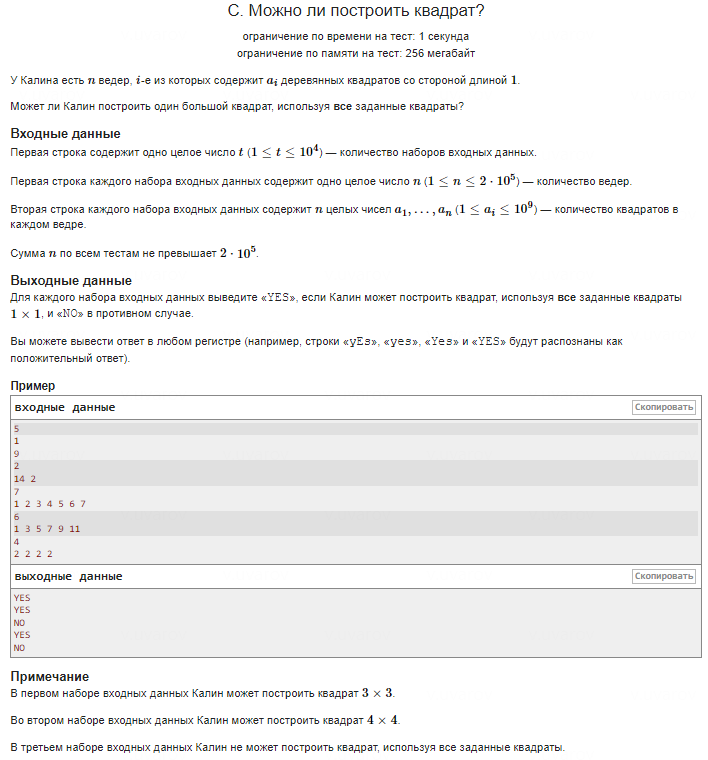

### Отчет: Проверка, является ли число целым

#### Идея проверки

Для проверки, является ли число целым, используется следующий фрагмент кода:
```cpp
double epsilon = 1e-6;  
long long nearest_int = (long long)(l + 0.5);  

if (abs(l - nearest_int) < epsilon && nearest_int * nearest_int == sum)
```
#### 1. Почему нужна точная проверка?

При работе с числами с плавающей запятой (double) их точность может быть недостаточной. Например, при вычислении квадратного корня результат может оказаться очень близким к целому числу, но из-за ошибок округления он может быть слегка меньше или больше ожидаемого значения, например: вместо 4.0 можно получить 3.999999 или 4.000001.

Для корректного определения, является ли число целым, простого сравнения недостаточно. Даже небольшие ошибки в десятичной части могут привести к неправильным результатам. Для этого применяется проверка с допуском.

#### 2. Что такое epsilon и зачем оно нужно?

epsilon — это маленькое значение, которое задает допустимую погрешность при сравнении числа с плавающей запятой с целым числом.
```cpp
double epsilon = 1e-6;
```
Это означает, что если разница между вычисленным значением `l` и ближайшим к нему целым числом меньше `epsilon`, то можно считать это число целым. Значение 1e-6 эквивалентно 0.000001 и задает минимальный допуск, который учитывает погрешности округления.

#### 3. Как работает округление с (long long)(l + 0.5)?

long long nearest_int = (long long)(l + 0.5);

Этот код берет результат вычисления квадратного корня `l` и округляет его до ближайшего целого числа. Если число меньше середины между двумя целыми числами (например, 4.4), оно будет округлено вниз (до 4). Если больше или равно середине (например, 4.5 или 4.6), оно будет округлено вверх (до 5).

Таким образом, получается ближайшее целое число к числу `l`.

#### 4. Проверка с использованием epsilon

После округления до ближайшего целого числа, проверяется, насколько вычисленное значение отличается от этого целого:
```cpp
if (abs(l - nearest_int) < epsilon)
```
Функция `abs(l - nearest_int)` вычисляет абсолютную разницу между `l` и ближайшим целым числом `nearest_int`. Если эта разница меньше, чем заданная погрешность `epsilon`, то можно считать, что число `l` достаточно близко к целому.

Например, если `l = 4.000001`, ближайшее целое число будет равно 4, а разница составит 0.000001, что меньше 1e-6. В таком случае число считается целым.

#### 5. Проверка квадрата

Кроме проверки разницы, также проверяется, действительно ли квадрат этого округленного числа равен исходной сумме:
```cpp
nearest_int * nearest_int == sum
```
Это дополнительная проверка, которая удостоверяет, что ближайшее целое число в квадрате точно дает исходное значение суммы `sum`, для которой вычислялся квадратный корень.

#### 6. Заключение

Число `l` округляется до ближайшего целого с помощью `(long long)(l + 0.5)`. Проверяется, что разница между округленным числом и исходным значением меньше заданной погрешности `epsilon`, чтобы учесть ошибки округления. После этого проверяется, что квадрат этого числа равен исходной сумме, что позволяет окончательно подтвердить корректность вычисления.

Таким образом, метод позволяет надежно определять, является ли вычисленное значение квадратного корня целым числом, несмотря на возможные ошибки округления.
