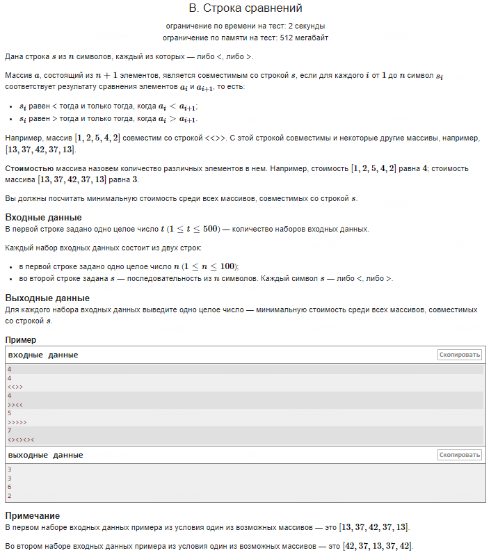

### Наиподробнейшее резюме по идее решения задачи

**Цель задачи** — найти минимальное количество различных чисел в массиве, которые соответствуют строке из символов сравнения `s`, состоящей из `<` и `>`. Массив должен быть таким, чтобы для каждого символа `<` выполнялось \( a_i < a_{i+1} \), а для каждого `>` — \( a_i > a_{i+1} \). 

### Как можно было прийти к решению

1. **Анализ задачи и формулировка условий:**
   - Понять, что каждый символ `<` требует, чтобы текущий элемент массива был меньше следующего.
   - Каждый символ `>` требует, чтобы текущий элемент был больше следующего.
   - Значит, если в строке `s` идут несколько подряд `<`, мы должны строить возрастающую последовательность. Если идут несколько подряд `>`, мы должны строить убывающую последовательность.

2. **Оптимизация: минимизация уникальных чисел:**
   - Основной вопрос в задаче — как уменьшить количество **различных** чисел в массиве при выполнении всех условий.
   - Если в строке `s` есть, например, последовательность `<<<`, то, чтобы выполнить все условия `<`, нам нужно создать 4 различных числа, чтобы сделать возрастающую последовательность: \( a_1 < a_2 < a_3 < a_4 \).
   - Точно так же, для последовательности `>>>`, нам нужно 4 числа, которые будут строго убывать.

3. **Общее решение через нахождение максимальной последовательности одинаковых символов:**
   - Если в строке `s` наибольшая последовательность подряд идущих `<` имеет длину `k`, то нам нужно как минимум `k + 1` различных чисел, чтобы создать подходящую возрастающую последовательность.
   - То же самое верно для `>`.
   - Таким образом, решением является **поиск максимальной длины последовательности одинаковых символов в строке `s` и прибавление единицы к этой длине**.

4. **Сложность задачи и её упрощение:**
   - Мы сводим задачу к простому проходу по строке `s`, чтобы найти максимальную длину подряд идущих одинаковых символов.
   - Эта задача становится проще, так как мы не ищем конкретный массив чисел, а просто определяем **минимальное количество различных чисел**, которые понадобятся для выполнения условий строки `s`.

### Почему это решение минимизирует количество уникальных чисел

Идея в том, что для любой длинной последовательности одинаковых символов требуется последовательность чисел на 1 больше по длине, чем эта последовательность. Например:
- Если `s = "<<<"`, нам нужно 4 числа для создания подходящей последовательности.
- Если `s = ">>>"`, аналогично, нам нужно 4 числа для построения убывающей последовательности.

В строке с перемежающимися символами, например `s = "<><><>"`, длина самой длинной последовательности одинаковых символов равна 1, и нам нужно всего 2 уникальных числа, чтобы чередовать их между `<` и `>`.

### Если вы не смогли прийти к решению, чего вам могло не хватить?

1. **Понимание минимизации через последовательности:**
   - Задача требовала увидеть, что наибольшая потребность в различных числах возникает в длинных последовательностях одного типа символов (`<` или `>`). Если вы не заметили эту закономерность, то задача могла показаться более сложной.

2. **Формализация проблемы:**
   - Возможно, вы пытались найти конкретные значения чисел, удовлетворяющих всем условиям, вместо того чтобы искать **общее правило для минимизации числа уникальных элементов**. Иногда задачи в программировании требуют абстрагироваться от конкретных примеров и найти общее правило.

3. **Алгоритмическое мышление:**
   - Решение основывается на простом обходе строки `s` и подсчёте длины последовательностей одинаковых символов. Это типичная задача на подсчёт и максимизацию, и здесь важно было сосредоточиться на простом проходе по строке и нахождении максимального результата.

4. **Навык "разделяй и властвуй":**
   - Умение разбить сложную задачу на более простые подзадачи — важный навык в олимпиадном программировании. В данном случае сложная задача сводится к нахождению длины наибольшей последовательности одинаковых символов. Если вы не пытались упростить задачу до этого уровня, она могла показаться трудной.

### Итоговый вывод

Решение задачи строится на понимании того, что для выполнения условий сравнений в строке `s` важно учитывать самые длинные последовательности одинаковых символов (`<` или `>`). Минимизация количества различных чисел достигается через нахождение длины такой последовательности и прибавление единицы. Это позволяет быстро и эффективно решить задачу, сводя её к простой задаче на поиск максимального количества подряд идущих символов.
