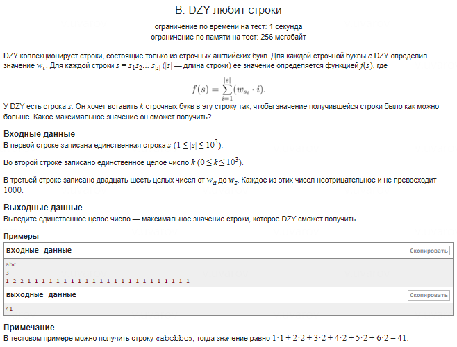

### Проблема переполнения целочисленного типа

При решении задачи на вычисление стоимости строки с использованием арифметической прогрессии возникла проблема переполнения знакового целочисленного типа `int`. Это происходит в выражении:
```cpp
price += max * (2 * size + k + 1) * k / 2;
```
Когда переменные `size` и `k` принимают большие значения (например, до 1000), результат вычисления произведения может превышать максимально допустимый диапазон для типа `int`. В C++ тип `int` обычно имеет диапазон от \(-2^{31}\) до \(2^{31}-1\), и если результат выходит за эти пределы, происходит переполнение, что приводит к неверному поведению программы или аварийному завершению.

Ранее использованный подход с циклом работал корректно, потому что промежуточные суммы добавлялись постепенно, и каждое отдельное значение оставалось в допустимых пределах для `int`. Однако при использовании формулы сразу происходит вычисление большого произведения, что и стало причиной переполнения.

### Особенность изменения типа в выражениях на примере `2LL`

Чтобы избежать переполнения, можно использовать механизм приведения типов внутри арифметических выражений. Это позволяет управлять тем, как компилятор обрабатывает вычисления, расширяя диапазон возможных значений. Один из примеров такого приведения — использование `2LL` в выражении:
```cpp
price += max * (2LL * size + k + 1) * k / 2;
```
#### Механизм приведения типов в выражениях:

- **Что происходит при использовании `2LL`:**
  - `2LL` означает, что число `2` следует рассматривать как значение типа `long long` (64-битное целое число).
  - В C++, при выполнении арифметических операций, типы операндов автоматически преобразуются в наибольший из используемых типов в выражении.
  - Если одно из чисел в выражении имеет тип `long long`, результат всего выражения будет рассчитан с использованием этого типа.
  - Таким образом, запись `2LL * size` преобразует `size` в `long long` и заставляет компилятор использовать 64-битную арифметику, что предотвращает переполнение.

#### Другие способы изменения типа в выражениях:

Кроме использования суффиксов вроде `LL`, существуют и другие способы изменения типа данных в выражениях:

1. **Использование явного приведения типов:**
   - Можно использовать явное приведение типов для изменения типа операнда:
    ```cpp
     price += max * (static_cast<long long>(2 * size) + k + 1) * k / 2;
    ```
     Здесь `static_cast<long long>` изменяет тип выражения `2 * size` на `long long`, что гарантирует использование 64-битной арифметики.

2. **Использование типа с плавающей точкой:**
   - Аналогично можно привести выражение к типу `double`, если необходимо работать с вещественными числами:
    ```cpp
     double result = static_cast<double>(a) / b;
    ```
     Это важно, когда нужно избежать целочисленного деления и получить точный результат.

3. **Суффиксы для других типов:**
   - В C++ можно использовать суффиксы для изменения типа литералов:
     - `2U` — `unsigned int` (беззнаковое целое число).
     - `2UL` — `unsigned long`.
     - `2.0f` — `float` (вещественное число одинарной точности).
     - `2.0` — `double` (вещественное число двойной точности).
   
   Например, использование `2UL` может помочь избежать переполнения при операциях с беззнаковыми целыми числами:
    ```cpp
     unsigned long large_value = 2UL * some_large_number;
    ```
#### Почему это важно:

Эти механизмы позволяют разработчику явно контролировать, как компилятор интерпретирует типы данных в выражениях. Это особенно полезно, когда работаешь с большими числами или при необходимости обеспечить точность вычислений, избегая переполнения или потери данных.

Таким образом, использование `2LL` — это способ сделать так, чтобы все промежуточные вычисления в выражении использовали более широкий диапазон `long long`, избегая проблем с переполнением, характерных для `int`. Этот подход обеспечивает корректную работу программы даже на больших входных данных.
