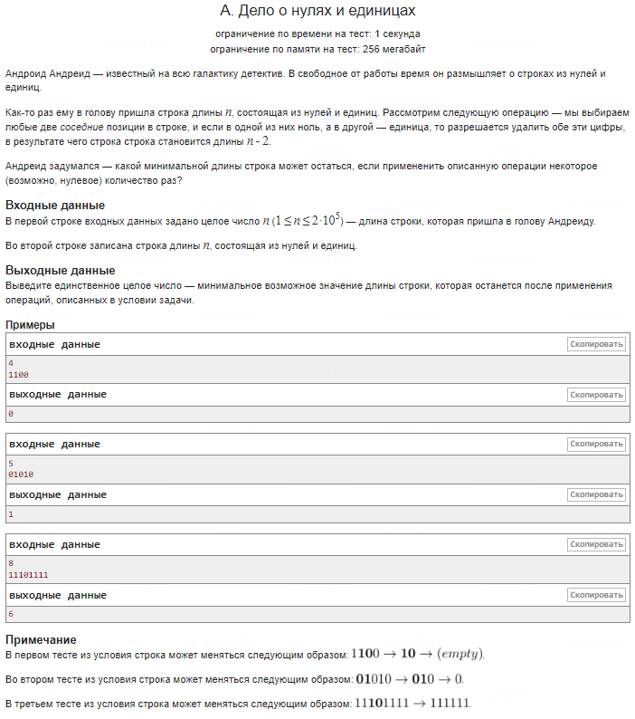

### Основная цель задачи

Основная цель задачи — минимизировать длину строки, состоящей из нулей ('0') и единиц ('1'), удаляя как можно больше пар соседних символов '0' и '1'. Каждая операция удаления уменьшает длину строки на два символа (один '0' и один '1'). Чтобы найти минимальную возможную длину строки, необходимо следовать следующей логике:

### 1 Вариант решения:

- **Определение количества пар**: Максимальное количество пар, которые можно удалить, определяется меньшим количеством символов между '0' и '1'. Каждая такая пара убирает один '0' и один '1' из строки.

- **Подсчет лишних символов**: После удаления всех возможных пар останутся лишние символы, которые невозможно попарить. Их количество — это абсолютная разница между числом '0' и числом '1' в строке.

- **Формула**: Минимальная длина строки равна абсолютной разнице между количеством нулей и единиц:

\[
\text{Минимальная длина} = |\text{Количество '0'} - \text{Количество '1'}|
\]

Таким образом, решение сводится к подсчету числа противоположных символов и вычитанию удвоенного количества пар из общего числа символов в строке. Оставшиеся символы и будут минимальной длиной строки.

### 2 Вариант решения:

- **Определение количества пар**: Максимальное количество пар, которые можно удалить, определяется меньшим количеством символов между '0' и '1'. Каждая такая пара убирает один '0' и один '1' из строки.

- **Подсчет лишних символов**: После удаления всех возможных пар останутся лишние символы, которые невозможно попарить. Их количество — это абсолютная разница между числом '0' и числом '1' в строке.

- **Формула**: Минимальная длина строки равна абсолютной разнице между количеством нулей и единиц:

\[
\text{Минимальная длина} = |\text{Количество '0'} - \text{Количество '1'}|
\]

Таким образом, решение сводится к подсчету числа противоположных символов и вычитанию удвоенного количества пар из общего числа символов в строке. Оставшиеся символы и будут минимальной длиной строки.
