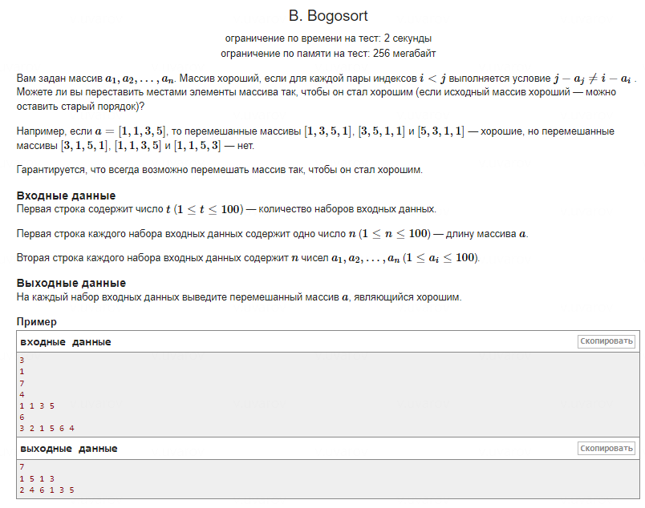

Чтобы решить эту задачу, нужно переставить элементы массива так, чтобы для каждого индекса \( i \) значение \( i - a_i \) было уникальным. Основная идея состоит в следующем:

1. **Отсортировать массив по убыванию**. Это помогает потому, что при размещении больших чисел в начале массива и меньших в конце, разницы \( i - a_i \) будут увеличиваться, что обеспечивает их уникальность.

2. **Разместить отсортированные элементы в массиве**. При этом разницы \( i - a_i \) будут принимать последовательные уникальные значения, поскольку \( a_i \) уменьшается, а \( i \) увеличивается.

3. **Проверить уникальность разниц \( i - a_i \)**. В отсортированном по убыванию массиве эти разницы естественно становятся уникальными и удовлетворяют условию задачи.

Таким образом, отсортировав массив по убыванию, мы получаем "хороший" массив, удовлетворяющий заданному условию.
