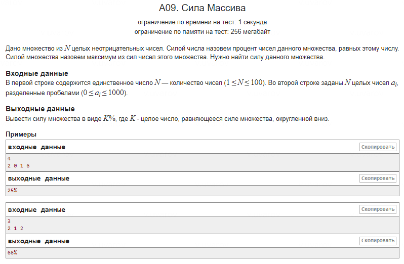

### Описание подходов, использованных в решении задачи

В данном проекте были применены оптимизированные подходы для эффективного решения задачи по подсчету силы множества. Ниже описаны основные методы, которые удалось усвоить и внедрить в код на основе полученных рекомендаций.

1. Избавление от лишнего массива и непосредственное считывание значений в массив частот

**Проблема:**

Изначально использовался дополнительный массив `n[]` для хранения всех введенных чисел:
```cpp
int n[100];

for (int i = 0; i < N; ++i) {
    cin >> n[i];
}
```
Это приводило к избыточному использованию памяти и усложняло код без существенной необходимости.

**Решение:**

Отказ от использования массива `n[]` и непосредственное считывание чисел с их одновременным сохранением в массиве частот `arr[]`:
```cpp
int arr[1001]{};

for (int i = 0; i < N; ++i) {
    int num;
    cin >> num;
    arr[num]++;
}
```
**Преимущества:**

- Экономия памяти: Удаление ненужного массива сокращает объем используемой памяти.
- Упрощение кода: Код становится более читабельным и простым для понимания.
- Эффективность: Сразу после считывания числа обновляется его частота, что ускоряет процесс обработки данных.

2. Подсчет частоты каждого числа с помощью массива `arr[]`

**Проблема:**

Первоначально для подсчета количества вхождений каждого числа использовались вложенные циклы:
```cpp
for (int i = 0; i < N; ++i) {
    int count_i = 0;
    for (int j = 0; j < N; ++j) {
        if (n[i] == n[j]) {
            count_i++;
        }
    }
    // Дальнейшая обработка count_i
}
```
Это приводило к квадратичной временной сложности O(N²), что неэффективно для больших объемов данных.

**Решение:**

Использование массива частот `arr[]`, где индекс массива соответствует числу, а значение по этому индексу — количеству его вхождений:
```cpp
int arr[1001] = {0};  // Инициализация массива частот

// Считывание чисел и обновление их частот
for (int i = 0; i < N; ++i) {
    int num;
    cin >> num;
    arr[num]++;
}
```

**Преимущества:**

- Линейная временная сложность O(N): Позволяет обрабатывать большие объемы данных эффективно.
- Удобство доступа к данным: Частота каждого числа доступна напрямую по индексу, без необходимости в дополнительных циклах.
- Снижение сложности кода: Отсутствие вложенных циклов упрощает понимание алгоритма и снижает вероятность ошибок.

### Заключение:

Применение этих подходов позволило значительно оптимизировать решение задачи, повысить его эффективность и качество. Использование массива частот и отказ от лишних структур данных являются хорошей практикой в алгоритмизации и программировании, особенно при работе с ограниченными ресурсами.

