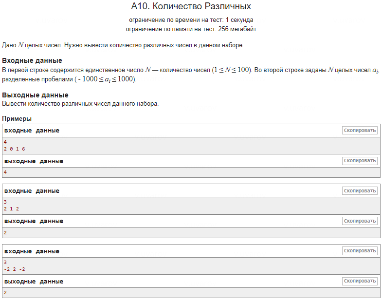

### Задача: Количество Различных Чисел

#### Более удачное решение:
- **Использование `bool` массива вместо `int`**:
  - **Меньший расход памяти**: использование массива `bool[2001]` занимает меньше памяти по сравнению с `int[2001]`, что может оказаться полезным при более жёстких ограничениях.
  - **Простота операций**: отметка присутствия числа через присвоение `true` проще и эффективнее по сравнению с инкрементом значений в массиве `int`.
  - **Производительность**: хотя различие в скорости минимально, операции с `bool` могут быть несколько быстрее за счёт меньшего объёма данных и более простых операций.

#### Сравнение кода:

**Более удачное решение:**

```cpp
bool presence[2001] = {false}; // Массив для отметки присутствия числа  
presence[ai + 1000] = true;    // Отмечаем число как присутствующее
```
**Оригинальное решение:**
```cpp
int n[2001] = {};              // Массив для подсчета количества вхождений  
n[num + 1000]++;               // Увеличиваем счётчик для числа
```
**Подсчёт уникальных чисел:**

**Более удачное решение:**
```cpp
if (presence[i]) {             // Проверяем только наличие числа  
    ++count;  
}
```
**Оригинальное решение:**
```cpp
if (n[j] > 0) {                // Проверяем наличие на основании количества вхождений  
    count++;  
}
```
#### Рекомендация:
Для данной задачи предпочтительнее использовать `bool` массив, так как это снижает расход памяти и минимально ускоряет выполнение программы.
