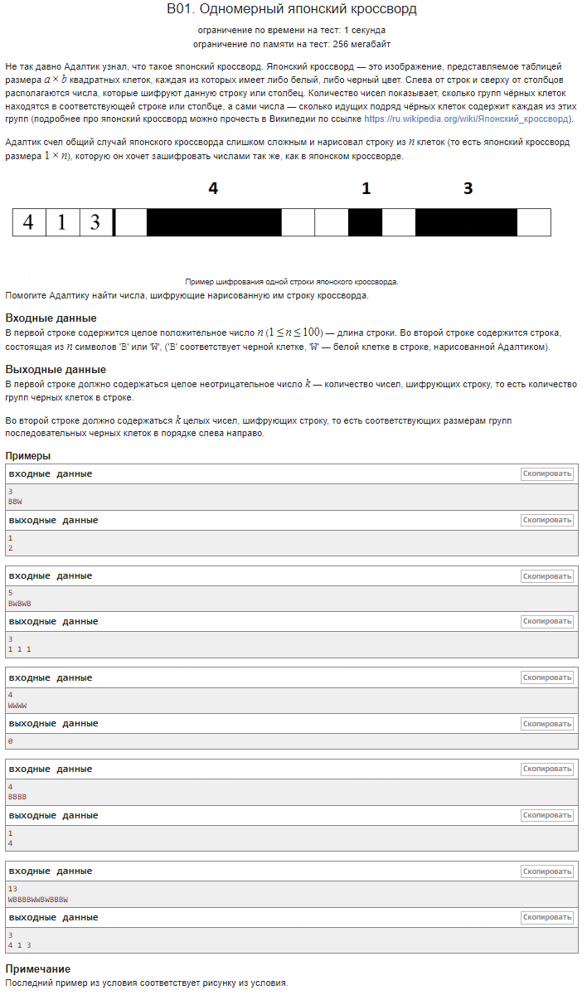

## Резюме сравнения кода решений

### Оригинальное решение

1. Используется массив `n[N+1]`, что создаёт риск выхода за пределы массива при обращении к элементу `s[N]`.
```cpp
   n[N+1]{};
```
2. Для отслеживания смены символов используется переменная `k_lag`.
```cpp
   char k_lag = '#';
```
3. Программа проходит по строке дважды:
   - Первый цикл для подсчёта групп.
   - Второй цикл для вывода размеров групп.
```cpp
   for (int i = 0; i < N; i++) {  
       if (s[i] == 'B') {  
           // Подсчёт групп  
       }  
   }
   
   for (int j = 0; j < N+1; j++) {  
       if (n[j] == 0 && k_sum != 0) {  
           // Вывод размеров групп  
       }  
   }
```
### Более удачное решение

1. Используется фиксированный массив `n[100]`, что упрощает работу с памятью и исключает риск выхода за пределы массива.
```cpp
   int n[100]{};
```
2. Логика программы упрощена и выполняется в одном цикле без использования дополнительных переменных, таких как `k_lag`.
```cpp
   for (int i = 0; i < N; i++) {  
       if (s[i] == 'B') {  
           count++;  
       } else {  
           if (count > 0) {  
               n[k++] = count;  
               count = 0;  
           }  
       }  
   }  
```
3. Дополнительная проверка после цикла для учёта последней группы.
```cpp
   if (count > 0) {  
       n[k++] = count;  
   }
```
---
4. Более олимпиадным приемом. Добавить в конец строки символ, который не может находиться во входных данных, например #. Тогда он образует новую группу (которая не выведется), а последняя группа исходной строки станет предпоследней и корректно обработается изначальным кодом.

```cpp
    s += '#';
```
Количество итераций увеличнино на 1 (`N+1`).
```cpp
   for (int i = 0; i < N+1; i++) {
        // цикл обработки строк
   }  
```
Этот способ хорош тем, что требует минимум дополнительных букв в коде, однако, он немного «портит» исходную строку и это нужно учитывать, если будет дальнейшая работа с этой строкой.
---
### Ключевые различия:

- **Массив**: В оригинальном решении используется `n[N+1]`, что приводит к риску выхода за пределы массива, тогда как в более удачном решении массив фиксированного размера `n[100]`.
- **Переменные**: Оригинальное решение использует переменную `k_lag` для отслеживания смены символов, что не требуется в более удачном решении.
- **Циклы**: Оригинальное решение использует два цикла для обработки строки, тогда как более удачное решение выполняет все действия в одном цикле.
- **Безопасность**: Более удачное решение исключает риск выхода за пределы массива и является более безопасным.
