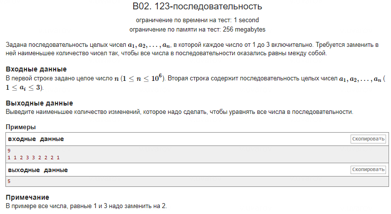

**Оригинальное решение:**

1. Программа подсчитывает количество каждого числа (1, 2 и 3) с использованием массива `arr[3]`, где `arr[0]` хранит количество единиц, `arr[1]` — количество двоек, и `arr[2]` — количество троек.
2. **Не удалось догадаться до формулы, что минимальное количество изменений будет равно общему количеству чисел минус количество вхождений самого часто встречающегося числа**.

**Более удачное решение:**

1. **Формула решения**: минимальное количество изменений = общее количество чисел `N` минус количество вхождений самого часто встречающегося числа.
2. Программа подсчитывает вхождения чисел и находит максимальное значение среди них с помощью условных операторов:
```cpp
    int maxCount = arr[0];  
    if (arr[1] > maxCount) {  
        maxCount = arr[1];  
    }  
    if (arr[2] > maxCount) {  
        maxCount = arr[2];  
    }  
```
3. Это позволяет находить максимальное значение без использования дополнительных библиотек.
4. Также можно использовать `std::max` из библиотеки `<algorithm>` для упрощения кода:
```cpp
    int maxCount = max({arr[0], arr[1], arr[2]});
```
5. После нахождения максимального количества выводится результат:

```cpp
    cout << N - maxCount << endl;
```