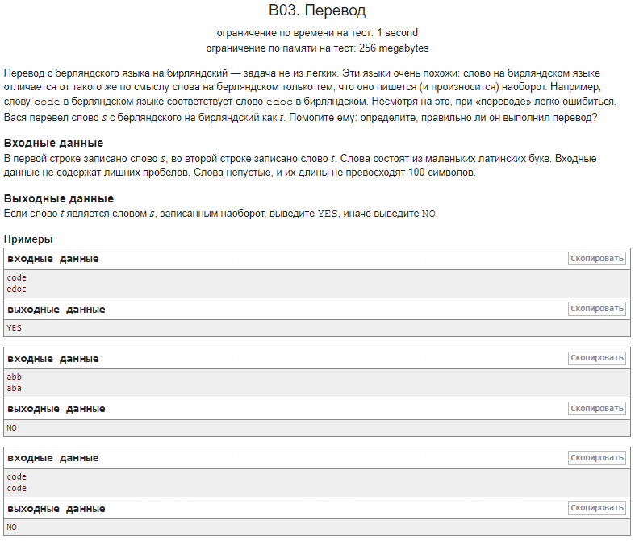

**Оригинальное решение:**
1. Сравнение символов с подсчетом совпадений:
```cpp
   for (int i=0; i<N_1; i++) {
       if (s_1[N_1-i-1] == s_2[i]) {
           count++;
       }
   }
```

2. Проверка совпадений через переменную `count`:
```cpp
   if (count == N_1) {
       cout << "YES";
   } else {
       cout << "NO";
   }
```

**Более удачное решение:**
1. Цикл с проверкой несовпадений и использованием `break`:
```cpp
   bool isReverse = true;
   for (int i = 0; i < N_1; ++i) {
       if (s_1[i] != s_2[N_1 - i - 1]) {
           isReverse = false;
           break;  // Цикл прерывается при первом несовпадении
       }
   }
```

2. Использование булевой переменной для вывода результата:
```cpp
   if (isReverse) {
       cout << "YES";
   } else {
       cout << "NO";
   }
```

**Вариант с `algorithm`:**
1. Использование стандартной функции для разворота строки:
```cpp
   std::reverse(s.begin(), s.end());
```

2. Сравнение строк напрямую:
```cpp
   if (s == t) {
       cout << "YES";
   } else {
       cout << "NO";
   }
```

**Примечание о `algorithm`:**
- `std::reverse()` из библиотеки `<algorithm>` эффективно переворачивает строку. Эта функция оптимизирована на низкоуровневом уровне, что делает ее более производительной и удобной, чем ручное написание цикла для разворота строки. Использование стандартной библиотеки позволяет писать более лаконичный и понятный код.

---
Вызов `reverse(s.begin(), s.end())` изменяет саму переменную `s`. Функция `reverse()` меняет порядок элементов в месте, то есть она не создает новую строку, а разворачивает исходную строку или контейнер.
---

### Что передается в `std::reverse()`:

- **Первый параметр** — итератор на начало диапазона. Для строки это `s.begin()`, который указывает на первый символ строки.
- **Второй параметр** — итератор на конец диапазона. Для строки это `s.end()`, который указывает на элемент за последним символом строки (фактически на "конец" строки).

### Механизм работы:

Функция `std::reverse()` работает следующим образом:
1. Сначала она берет элемент с начала диапазона и элемент с конца (с использованием итераторов).
2. Эти элементы меняются местами.
3. Затем итераторы сдвигаются: один — к середине с начала, другой — к середине с конца, и процесс повторяется.
4. Процесс продолжается, пока не достигнута середина диапазона.

### Почему это эффективно:

- `std::reverse()` использует итераторы, что делает его универсальным для работы с любыми контейнерами, которые поддерживают двунаправленные итераторы (например, строки, вектора, списки).
- Функция работает за **O(n)**, где **n** — количество элементов в диапазоне, так как каждому элементу нужно поменяться местами с его противоположным элементом ровно один раз.
- Эта функция максимально оптимизирована в стандартной библиотеке и предпочтительна для операций, связанных с разворотом диапазонов.

