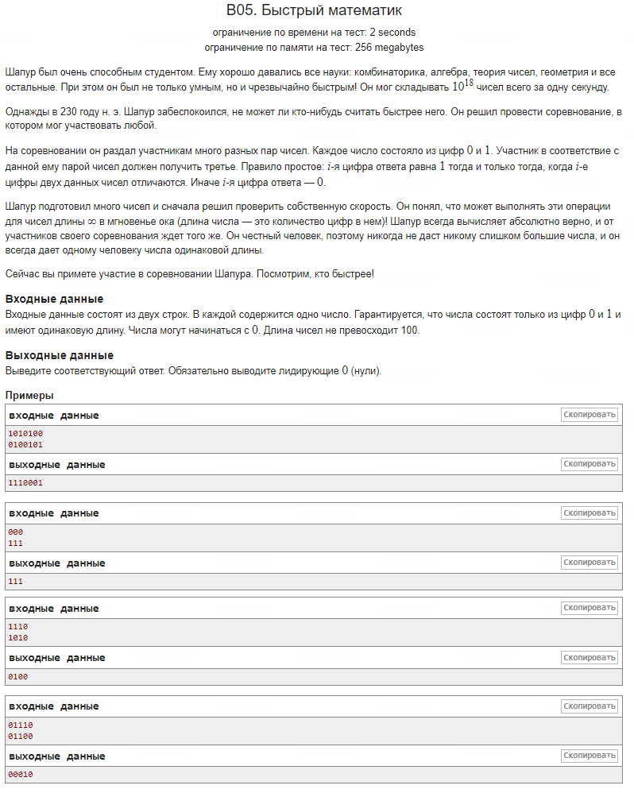

### Резюме сравнения решений

**Оригинальное решение:**

Использование условного оператора для сравнения символов:
```cpp   
   if (a[i] != b[i]) {
       cout << 1;
   } else {
       cout << 0;
   }
```
В оригинальном решении для каждого символа строк `a` и `b` выполняется проверка с помощью условного оператора `if-else`. Если символы различны, выводится `1`, иначе — `0`. Этот подход ясен, но использование условных операторов приводит к ветвлениям, что может негативно сказаться на производительности при большом объёме данных.

**Преимущества и недостатки:**
- **Плюсы:** Простой и понятный код, легко отслеживать логику работы.
- **Минусы:** Условные операторы создают ветвления, что может замедлить выполнение программы на больших данных.

**Возможное решение:**

Использование побитовой операции XOR для сравнения символов:
```cpp  
   char result_char = ((a[i] - '0') ^ (b[i] - '0')) + '0';
   std::cout << result_char;
```
Здесь вместо условий применяется операция XOR для сравнения символов строк. Операция XOR возвращает `1`, если символы различны, и `0`, если одинаковы. Это позволяет избавиться от ветвлений, что делает решение более эффективным.

**Как работает приём:**
- `a[i] - '0'` и `b[i] - '0'`: Преобразуют символы '0' и '1' в целые числа 0 и 1.
- Операция XOR (`^`): Возвращает `1`, если два числа различны, и `0`, если они одинаковы.
- Добавление `'0'`: Преобразует результат обратно в символ ('0' или '1').

**Преимущества и недостатки:**
- **Плюсы:** Устраняются ветвления, что улучшает производительность. Побитовые операции выполняются быстрее, чем условия.
- **Минусы:** Такой подход может быть менее очевидным для тех, кто не знаком с побитовыми операциями.

**Более эффективное решение с использованием `cstdio`:**

Использование низкоуровневых функций для ускорения ввода/вывода:
```cpp  
   putchar(((a[i] - '0') ^ (b[i] - '0')) + '0');
```
Это решение использует ту же побитовую операцию XOR, но вместо потоков `cin` и `cout` задействует низкоуровневые функции `scanf` и `putchar`. Такие функции обеспечивают более быстрый ввод и вывод, что особенно важно при работе с большими объёмами данных.

**Преимущества и недостатки:**
- **Плюсы:** Быстрее за счёт низкоуровневого ввода и вывода, что сокращает накладные расходы.
- **Минусы:** Код становится менее удобным для чтения и сопровождения, так как строки имеют фиксированный размер, и требуется работа с массивами символов вместо стандартных строк C++.

**Заключение:**

- **Оригинальное решение** с условными операторами простое и понятное, но может замедлить выполнение программы на больших данных из-за ветвлений.
- **Возможное решение** с побитовой операцией XOR исключает ветвления, что делает его более производительным и элегантным.
- **Более эффективное решение** с использованием `cstdio` оптимизирует ввод и вывод за счёт низкоуровневых функций, но делает код менее гибким и сложнее для понимания.

---
### Дополнительная информация

1. **Как работает `scanf("%100s%100s", s1, s2)` и `putchar`?**

   - `scanf("%100s%100s", s1, s2)` используется для ввода двух строк. Формат `%100s` ограничивает длину вводимой строки до 100 символов, а строки помещаются в массивы `s1` и `s2`.
   - `putchar` выводит один символ на экран. В задаче используется для вывода результата побитовой операции между символами строк `s1` и `s2`.

2. **Почему `s1[i] - '0'` преобразует буквы в цифры?**

   - Символы '0', '1', и т.д. имеют свои ASCII-коды (например, '0' — это 48). Когда вычитаем `'0'`, мы по сути вычитаем 48, и символ `'0'` превращается в число 0, а `'1'` — в число 1. Это позволяет работать с цифрами как с числами.

3. **Что такое `^`?**

   - `^` — это побитовая операция XOR (исключающее ИЛИ). Она возвращает `1`, если два бита различны, и `0`, если одинаковы. В контексте задачи это означает: если символы в строках совпадают — результат 0, если различаются — результат 1.

4. **Почему `'0'` преобразует цифры назад в буквы?**

   - После вычисления побитовой операции результат — число (например, 0 или 1). Чтобы преобразовать это число обратно в символ, мы добавляем `'0'`. Например, 0 + `'0'` превращается в символ `'0'`, а 1 + `'0'` превращается в символ `'1'`.
---
