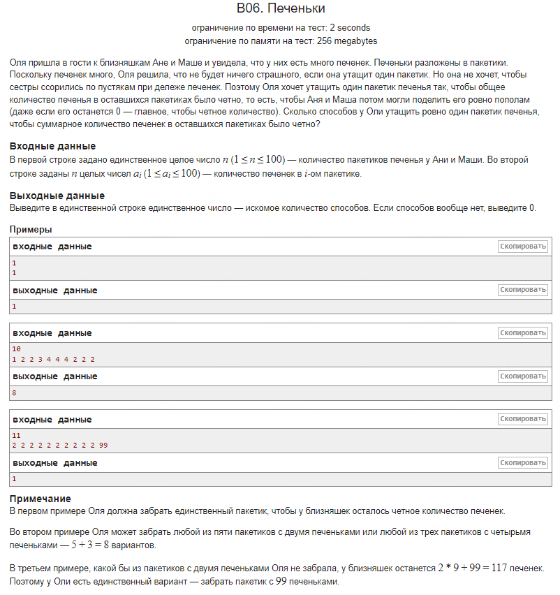

---

### Оригинальное решение

1. **Чтение данных**: Вводится количество пакетиков и заполняется массив печенек.
```cpp
   int N;
   int n[100];
```

2. **Вычисление общей суммы**: Подсчитывается сумма всех печенек во всех пакетиках.
```cpp
   sum += num;
```

3. **Перебор и проверка**: Для каждого пакетика проверяется, станет ли сумма оставшихся печенек чётной после его удаления.
```cpp
   if ((sum - n[i]) % 2 == 0)
```

### Более удачное решение

1. **Чтение данных**: Вводится количество пакетиков, но массив для хранения значений не используется.
```cpp
   int even_count = 0, odd_count = 0;
```

2. **Оптимизация через паритет**: Вместо того чтобы проверять каждый пакетик на чётность суммы после его удаления, производится подсчёт количества чётных и нечётных пакетиков.

   Чётность (паритет) общей суммы имеет ключевое значение: если сумма чётная, нам нужно удалить чётный пакетик, чтобы чётность сохранилась. Если сумма нечётная, нам нужно удалить нечётный пакетик, чтобы сделать оставшуюся сумму чётной.

   Для этого достаточно одного прохода по массиву для подсчёта чётных и нечётных пакетиков:
```cpp
   total_sum += ai;
   if(ai % 2 == 0)
       even_count++;
```

3. **Определение результата**: Чётность общей суммы определяет, какие пакетики нужно удалить: если сумма чётная, удаляем чётные пакетики; если сумма нечётная, удаляем нечётные. Это выражается через тернарный оператор:
```cpp
   int result = (total_sum % 2 == 0) ? even_count : odd_count;
```

### Сравнение:

1. **Время выполнения**:
   - **Оригинальное**: Два прохода по массиву — один для вычисления суммы и другой для проверки каждого пакетика.
   - **Более удачное**: Один проход по массиву с подсчётом чётных и нечётных элементов и использованием паритета.

2. **Использование памяти**:
   - **Оригинальное**: Используется массив для хранения печенек.
   - **Более удачное**: Массив не используется, требуется только несколько переменных для подсчёта.

3. **Оптимизация**:
   - **Оригинальное**: Дополнительный массив и двойной перебор.
   - **Более удачное**: Более эффективный подсчёт и проверка за один проход.

### Математическая идея паритета:

#### Чётность и нечётность суммы:
Сумма чисел может быть либо чётной, либо нечётной:

- **Чётная сумма** — это такая сумма, которая делится на 2 без остатка.
- **Нечётная сумма** — это такая сумма, которая при делении на 2 даёт остаток 1.

#### Когда сумма становится чётной:

- Если из чётной суммы вычесть чётное число, то результат останется чётным. Например, 8 − 2 = 6.
- Если из чётной суммы вычесть нечётное число, то результат станет нечётным. Например, 8 − 3 = 5.
- Если из нечётной суммы вычесть нечётное число, то результат станет чётным. Например, 7 − 3 = 4.
- Если из нечётной суммы вычесть чётное число, то результат останется нечётным. Например, 7 − 2 = 5.

#### Идея решения:
Пусть общая сумма печенек в пакетиках равна \( S \). Мы хотим найти количество способов убрать один пакетик так, чтобы сумма оставшихся печенек была чётной. В зависимости от того, чётная ли сумма \( S \) или нечётная, возникают два сценария:

- Если \( S \) чётное число:
  - Чтобы сумма оставшихся печенек тоже была чётной, нужно удалить один из пакетиков с чётным количеством печенек.
  - Это связано с тем, что вычитание чётного числа из чётного сохраняет чётность.
  
- Если \( S \) нечётное число:
  - Чтобы сумма оставшихся печенек стала чётной, нужно удалить один из пакетиков с нечётным количеством печенек.
  - Это связано с тем, что вычитание нечётного числа из нечётного делает сумму чётной.

#### Тернарная операция:
На основе этой логики, можно сделать следующее наблюдение:

- Если \( S \) чётное, то нам подходят все пакетики с чётным количеством печенек.
- Если \( S \) нечётное, то нам подходят все пакетики с нечётным количеством печенек.

#### Формула:
\[ \text{result} = (S \mod 2 == 0) ? \text{even_count} : \text{odd_count} \]

Эта формула позволяет нам на основе чётности суммы \( S \) быстро определить, сколько вариантов удаления одного пакетика обеспечат чётную оставшуюся сумму.

### Вывод:
Более удачное решение выигрывает за счёт меньшего использования памяти и более эффективного подхода к проверке условия через паритет.
