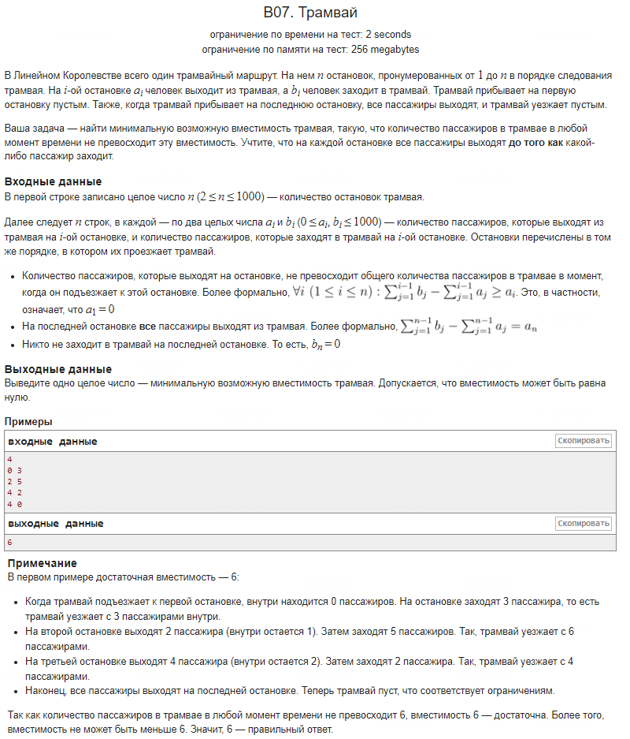

### Резюме

Необходимо внимательнее читать задание, так как согласно условиям задачи гарантируется, что количество выходящих пассажиров на каждой остановке не превышает количество пассажиров, находящихся в трамвае при подъезде к этой остановке. То есть, всегда выполняется неравенство `passengers ≥ a` на каждой остановке, и переменная `passengers` не должна становиться отрицательной после операции `passengers -= a`.

### Анализ

**Необходимость:** Учитывая, что по условию задачи количество выходящих пассажиров не превышает текущее количество пассажиров в трамвае, дополнительная проверка на отрицательное значение переменной `passengers` не требуется.

**Влияние на эффективность:** Дополнительная проверка `if` добавляет условное ветвление и потенциальное присваивание в каждой итерации цикла. Хотя это незначительно сказывается на производительности при небольших значениях `n` (до 1000), эта проверка избыточна в контексте заданных ограничений.

Таким образом, внимательное прочтение задания позволяет избежать ненужных проверок и сделать решение более эффективным.
