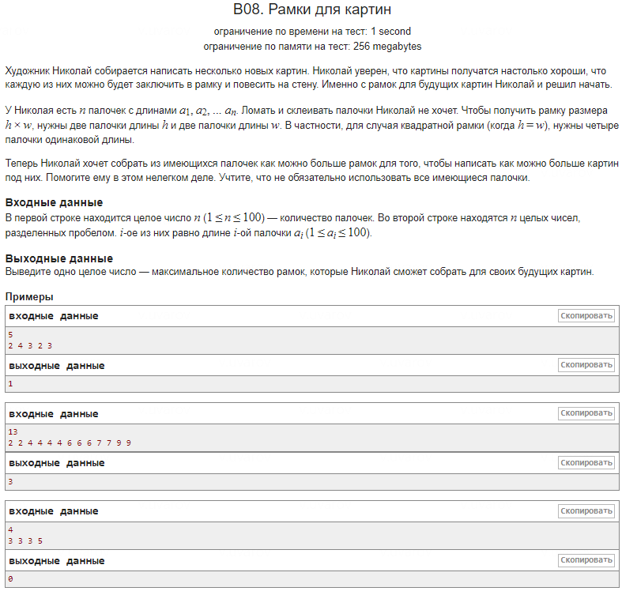

1. **Оригинальное решение:**
   - Использует массив длиной 101 для хранения количества палочек каждой длины.
   - Подсчитывает количество четных палочек с помощью операции:
    ```cpp
     sum_a = sum_a + (arr[i] - arr[i] % 2);
    ```
     Это позволяет отбрасывать нечетные палочки, если их количество нечетное.
   - Итоговое количество рамок вычисляется через:
    ```cpp
     sum_a / 4;
    ```

2. **Преимущества и недостатки:**
   - **Плюсы:** 
     - Меньшее количество операций деления.
     - Эффективная арифметика для подсчета четных палочек без дополнительного деления.
   - **Минусы:**
     - Логика с модулем и вычитанием может быть менее очевидной и труднее для модификации, особенно для других программистов.

3. **Возможное решение:**
   - Явное деление на 2 для подсчета пар:
    ```cpp
     total_pairs += cnt[i] / 2;
    ```
     Это позволяет напрямую подсчитывать количество пар палочек для каждой длины.
   - Максимальное количество рамок вычисляется через:
    ```cpp
    total_pairs / 2;
    ```

4. **Объяснение работы приёма:**
   - В предложенном решении используется явное деление для подсчета пар палочек. Это делает код более прозрачным и интуитивным для понимания, так как отдельно отслеживаются пары палочек, и затем они делятся на две для получения числа рамок.

5. **Преимущества и недостатки возможного решения:**
   - **Плюсы:** 
     - Четкий и понятный подсчет пар через деление. Легче интерпретировать и изменять.
     - Логика кода легко расширяется или модифицируется.
   - **Минусы:** 
     - Дополнительные операции деления могут незначительно снизить производительность на больших входных данных, хотя разница минимальна.

6. **Заключение:**
   - **Ключевые отличия:** Оригинальное решение минимизирует количество операций деления, используя модуль для фильтрации четных элементов, в то время как возможное решение более явно и интуитивно подсчитывает количество пар через деление.
   - Оригинальное решение может быть немного быстрее из-за меньшего количества делений, но его логика может быть менее очевидна. Возможное решение предпочтительнее с точки зрения читабельности и легкости модификации.
   - В обоих случаях временная сложность — **O(n)**, а пространственная сложность — **O(1)**.

---

### Решение с применением модуля vector

**Что такое `vector`?**

`vector` — это контейнер из стандартной библиотеки C++ (std::vector), который предоставляет динамически изменяемый массив. Это значит, что в отличие от статических массивов, размер которых нужно задавать заранее, `vector` может изменять свой размер автоматически, когда добавляются новые элементы.

**Зачем нужен `vector` и как он работает?**

1. **Гибкость в размерах:** В отличие от статических массивов, которые имеют фиксированный размер, `vector` может динамически изменять размер при добавлении новых элементов. Это делает его особенно полезным в ситуациях, когда заранее неизвестно, сколько данных нужно хранить.
   
2. **Автоматическое управление памятью:** Когда размер вектора увеличивается, он автоматически выделяет новую память и копирует в неё старые элементы. Это упрощает управление памятью и предотвращает утечки памяти.

3. **Эффективность:** Вектора реализованы на основе динамических массивов, поэтому доступ к элементам происходит за O(1), как и в случае с обычными массивами. Это делает их такими же быстрыми при доступе, но с дополнительной гибкостью.

4. **Безопасность:** В отличие от простых массивов, которые легко могут выйти за границы допустимого диапазона индексов, `vector` предоставляет методы для проверки размера, такие как .size(), и может выбросить исключение при неправильном доступе через метод .at().

**Почему `vector` эффективнее обычного массива?**

- **Управление памятью:** Вектор автоматически изменяет свой размер, выделяя больше памяти, если это необходимо. В обычных массивах программисту нужно самому заботиться об этом.
- **Универсальность:** Вектор поддерживает множество полезных функций, таких как добавление элементов через .push_back(), удаление через .erase() и доступ к последнему элементу через .back().
- **Итераторы:** Вектора поддерживают работу с итераторами, что делает их удобными для многих алгоритмов, связанных с обработкой данных.

**Пример использования `vector` в задаче:**

Вместо использования обычного массива для хранения длин палочек, можно использовать `vector`:

```cpp
std::vector<int> cnt(101, 0); 
// Создаем вектор с 101 элементом, инициализируем нулями

// Считываем длины палочек и заполняем вектор
for (int i = 0; i < n; ++i) {
    int ai;
    std::cin >> ai;
    ++cnt[ai];
}

// Подсчитываем количество пар
for (int i = 1; i <= 100; ++i) {
    total_pairs += cnt[i] / 2;
}

std::cout << total_pairs / 2 << std::endl;
```