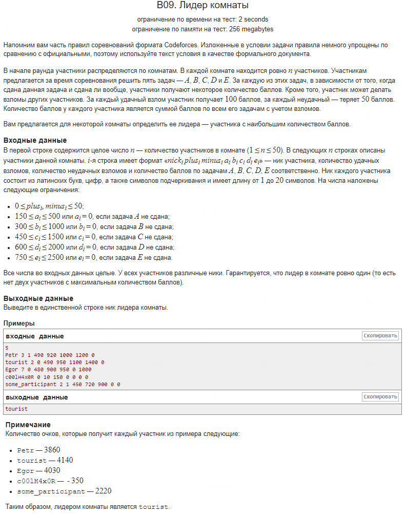

1. **Оригинальное решение:**
   - **Основная логика:** В оригинальном решении ввод данных и расчет очков выполняются в одном цикле, без использования дополнительных структур для хранения информации об участниках:
```cpp
   string nick;
   int plus, minus, a, b, c, d, e;
   int score = 0;

   cin >> nick >> plus >> minus >> a >> b >> c >> d >> e;
   score += 100 * plus - 50 * minus + a + b + c + d + e;
```

   - **Вычисление максимума:** Логика определения лидера осуществляется сразу после расчета очков:
```cpp
   if (i == 0) {
       result = nick;
       max_score = score;
   } else if (score > max_score) {
       result = nick;
       max_score = score;
   }
```

   - **Недостатки:** Не используется массив для хранения участников. Прямой ввод и расчет без структур делает код менее гибким и не масштабируемым для больших объемов данных.

2. **Вариант 2:**
   - **Основная логика:** Здесь ввод участников реализован через фиксированный массив структур Participant, который ограничен 50 элементами:
```cpp
   Participant participant[50];
```

   - Каждый участник вводится в структуру массива:
```cpp
   cin >> p.nick >> p.plus >> p.minus >> p.a >> p.b >> p.c >> p.d >> p.e;
   p.score = 100 * p.plus - 50 * p.minus + p.a + p.b + p.c + p.d + p.e;
```

   - **Вычисление максимума:** Аналогично оригинальному решению, максимальные очки и индекс лидера определяются в отдельном цикле:
```cpp
   if (participant[i].score > max_score) {
       index_leader = i;
       max_score = participant[i].score;
   }
```

   - **Преимущества:** Код становится чище за счет использования структур и массивов.
   - **Недостатки:** Ограничение в 50 участников снижает гибкость программы.

3. **Вариант 3:**
   - **Основная логика:** Данный вариант использует динамический массив (vector), что снимает ограничение на количество участников. Для хранения данных о каждом участнике используется структура Participant.
```cpp
   vector<Participant> participants(N);
```

   - **Ввод данных:** Считывание строк происходит с помощью функции getline, а затем строка разбивается на части с использованием строкового потока:
```cpp
   getline(cin, line);
   istringstream iss(line);
   iss >> p.nick >> p.plus >> p.minus >> p.a >> p.b >> p.c >> p.d >> p.e;
```

   - **Вычисление максимума:** Логика аналогична предыдущим решениям, но с использованием динамического массива:
```cpp
   if (participants[i].score > max_score) {
       max_score = participants[i].score;
       leader_nick = participants[i].nick;
   }
```

   - **Преимущества:** Решение гибкое за счет использования динамической памяти и структур.
   - **Недостатки:** Производительность может быть чуть ниже из-за работы с динамическими структурами и строковыми потоками.

### Сравнение производительности

1. **Время выполнения:**
   - **Оригинальное решение:** Выполняется быстрее за счет простоты — нет дополнительных структур.
   - **Вариант 2:** Аналогичное время выполнения, но с накладными расходами на работу с фиксированным массивом.
   - **Вариант 3:** Медленнее из-за использования динамической памяти и строковых потоков.

2. **Использование памяти:**
   - **Оригинальное решение:** Минимум использования памяти, только необходимые переменные.
   - **Вариант 2:** Использует память заранее выделенную под фиксированный массив.
   - **Вариант 3:** Динамическая память, что делает решение более гибким, но менее эффективным по сравнению с фиксированными массивами.

### Заключение:
- **Оригинальное решение** быстрее за счет минимальной обработки данных, но оно не гибкое.
- **Вариант 2** улучшает код за счет структур, но ограничивает количество участников.
- **Вариант 3** — наиболее гибкое и организованное решение, но оно может быть медленнее из-за динамических структур и строковых операций.

---

### Дополнительная информация

1. **Структуры в C++:**
   Структуры (struct) в C++ позволяют объединить несколько переменных разного типа в одну сущность. Это упрощает работу с данными, делает код более понятным и логичным. Например, структура Participant в задаче группирует параметры участника: имя, очки и другие атрибуты.
```cpp
   struct Participant {
       char nick[21];
       int plus, minus, a, b, c, d, e, score;
   };
```

   Структуры помогают организовать код, сделать его легче для чтения и модификации. Они также эффективны, так как данные внутри структуры хранятся последовательно в памяти, что упрощает доступ и работу с ними.

   **Эффективность:** Структуры эффективны по использованию памяти, так как они хранят данные последовательно. Однако, при использовании сложных типов данных (например, динамических объектов или строк) могут возникнуть дополнительные накладные расходы.

2. **Строка Participant() : plus(0), minus(0), a(0), b(0), c(0), d(0), e(0), score(0) {}**:
   Это конструктор по умолчанию для структуры Participant, который инициализирует все поля значениями 0. Такой подход защищает от ошибок, связанных с использованием неинициализированных переменных, что может привести к некорректным результатам.

3. **Строка cin.ignore()**:
   Эта строка игнорирует символ новой строки ('\n'), оставшийся после ввода числа N. Без этой команды следующий вызов getline может завершиться немедленно, считав пустую строку вместо ожидаемой строки с данными участника. Эта операция нужна для корректного ввода последующих строк.

4. **Строки getline(cin, line); и istringstream iss(line);**:
   - **getline(cin, line);** считывает полную строку текста, включая пробелы, в переменную line. Это позволяет обрабатывать строковые данные целиком.
   - **istringstream iss(line);** создает поток на основе строки line, который затем используется для разбора строки на части:
```cpp
     iss >> p.nick >> p.plus >> p.minus >> p.a >> p.b >> p.c >> p.d >> p.e;
```

     Это позволяет последовательно извлекать данные из строки и заполнять соответствующие поля структуры Participant. Этот подход особенно удобен для обработки строк с несколькими параметрами, разделенными пробелами.
