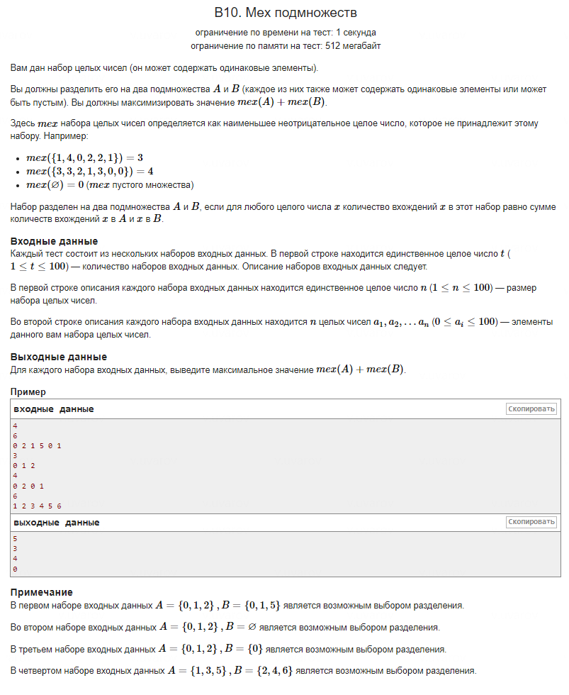

// #include <iostream>

// using namespace std;

// int main() {

//     int N;
//     cin >> N;

//     for (int i=0; i<N; ++i) {

//         int M;
//         int arr[101]{};

//         cin >> M;

//         for (int j=0; j<M; ++j) {

//             int num;
//             cin >> num;
//             arr[num]++;
//         }

//         // for (int k=0; k<101; ++k) {
//         //     if (A[j]==0) {
//         //         mex_A=j;
//         //         break;
//         //         }
//         // }

//         // cout << mex_A << endl;
//         // cout << mex_B << endl;

//         cout << "nen-" << 0%2 << endl;

//         // cout << mex_A + mex_B;

//     }

//     return 0;
// }

