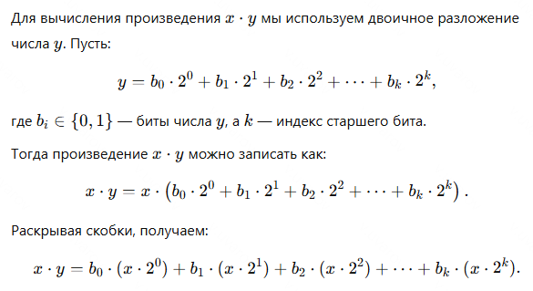
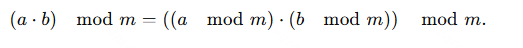
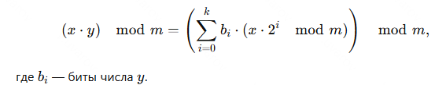
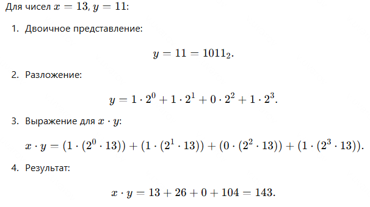
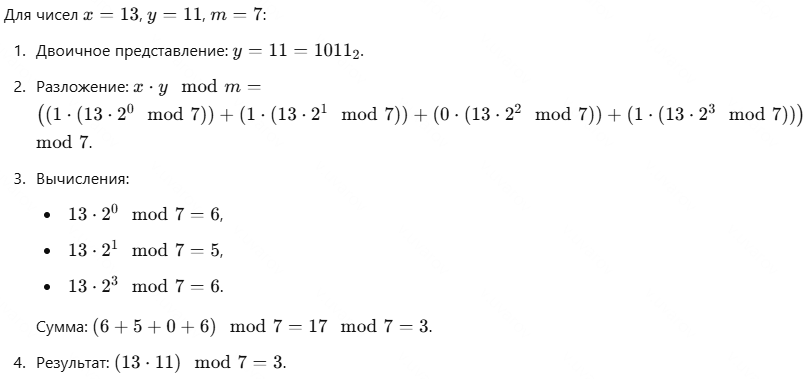
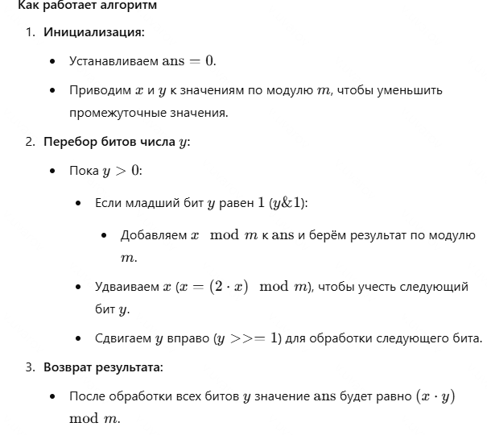

# Модульное умножение больших чисел

## Описание алгоритма

Этот алгоритм вычисляет произведение двух чисел \(x\) и \(y\) по модулю \(m\), избегая переполнения. Он основан на бинарной декомпозиции числа \(y\) и последовательном сложении значений \(x \mod m\), умноженных на степени двойки, соответствующие каждому установленному биту в \(y\).

---

## Сложность алгоритма

- **Временная сложность**: \(O(\log y)\), так как каждый шаг цикла уменьшает \(y\) вдвое.
- **Пространственная сложность**: \(O(1)\), так как используются только несколько дополнительных переменных.

---

## Математическое обоснование

### Простое умножение через двоичное разложение

---

### Свойство произведения по модулю

Для работы с большими числами важно, что произведение по модулю \(m\) может быть вычислено поэтапно, чтобы избежать переполнения:

При использовании двоичного разложения \(y\), мы выполняем все промежуточные операции по модулю \(m\), что позволяет поддерживать значения в допустимых границах.

---

### Итоговая формула

Используя модульные свойства, итоговое выражение для модульного умножения выглядит следующим образом:

---

## Пример произведения

---

## Пример произведения по модулю

---

## Как работает алгоритм

---

## Итог

Этот алгоритм эффективно вычисляет модульное умножение больших чисел, используя двоичное представление множителя \(y\). Подход позволяет избежать переполнения, так как все промежуточные вычисления выполняются по модулю \(m\). Алгоритм имеет логарифмическую временную сложность \(O(\log y)\) и подходит для работы с большими числами. 
