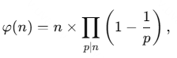
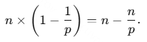
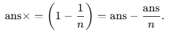

# Вычисление функции Эйлера \(\varphi(n)\)

## Описание алгоритма

Этот алгоритм вычисляет функцию Эйлера \(\varphi(n)\), которая определяет количество чисел от \(1\) до \(n\), взаимно простых с \(n\). Он основан на последовательном уменьшении значения \(n\) путём вычитания вкладов от каждого простого делителя.

## Сложность алгоритма

- **Временная сложность**: \(O(\sqrt{n})\), где \(n\) — входное число.
- **Пространственная сложность**: \(O(1)\), так как используются только несколько переменных.

---

## Математическое обоснование

Функция Эйлера вычисляется по формуле:

где произведение берётся по всем уникальным простым делителям числа \(n\).

Для каждого простого делителя \(p\), его вклад в \(\varphi(n)\) выражается как:

Таким образом, каждый раз при нахождении простого делителя \(p\) значение \(\varphi(n)\) уменьшается на \(\frac{n}{p}\).

---

## Как работает алгоритм

1. **Инициализация:**
   - Устанавливаем начальное значение \(\text{ans} = n\).

2. **Перебор делителей:**
   - Проходим все числа \(i\) от \(2\) до \(\sqrt{n}\).
   - Если \(i\) является делителем \(n\), то:
     - Удаляем все степени \(i\) из \(n\), последовательно деля \(n\) на \(i\), пока \(n \mod i = 0\).
     - Уменьшаем \(\text{ans}\) на \(\frac{\text{ans}}{i}\), что соответствует учёту вклада делителя \(i\).

3. **Обработка оставшегося числа:**
   - Если после перебора всех делителей \(n > 1\), то оставшееся \(n\) — простой делитель, и его вклад учитывается как:

     

4. **Возврат результата:**
   - Финальное значение \(\text{ans}\) равно \(\varphi(n)\).

---

## Итог

Алгоритм эффективно вычисляет \(\varphi(n)\), уменьшая значение \(n\) и накапливая результат через последовательное вычитание долей, связанных с простыми делителями числа. Этот подход делает его простым и удобным для реализации.
