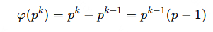
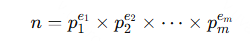
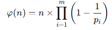
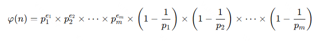
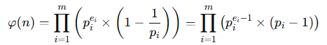
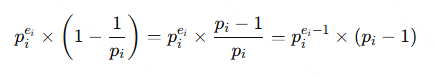

# Вычисление функции Эйлера \(\varphi(n)\)

## Описание алгоритма

Этот алгоритм вычисляет функцию Эйлера \(\varphi(n)\), определяющую количество чисел от \(1\) до \(n\), взаимно простых с \(n\). Алгоритм основан на разложении числа \(n\) на простые множители и использовании их степеней для поэтапного вычисления результата.

## Сложность алгоритма

- **Временная сложность**: \(O(\sqrt{n})\), где \(n\) — входное число.
- **Пространственная сложность**: \(O(1)\).

---

## Математическое обоснование

### Функция Эйлера для степени простого числа

Для простого числа \(p\) и натурального числа \(k\):

Это означает, что количество чисел, меньших \(p^k\) и взаимно простых с ним, равно \(p^{k - 1}(p - 1)\).

---

## Общий случай для числа \(n\), разложенного на простые множители

Пусть \(n\) раскладывается на простые множители следующим образом:

Тогда функция Эйлера выражается как:

Или, эквивалентно:

---

## Выражение через произведение множителей

Перепишем \(\varphi(n)\) с учётом степеней простых чисел:

Это следует из того, что:

---

## Как работает алгоритм

1. **Первое вхождение простого делителя \(p\):**

   При первом нахождении делителя \(p\) выполняется операция:

   \[
   \text{ans} \times= (p - 1).
   \]

   Это отражает множитель \((p - 1)\) в формуле \(\varphi(p^k) = p^{k-1}(p - 1)\).

2. **Последующие вхождения \(p\):**

   Для каждого последующего деления на \(p\) выполняется:

   \[
   \text{ans} \times= p.
   \]

   Это накапливает множитель \(p^{k-1}\), соответствующий степени \(k\) простого делителя \(p\).

3. **Обработка оставшегося числа:**

   Если после перебора всех \(p \leq \sqrt{n}\) остаётся значение \(k > 1\), то \(k\) является простым делителем, и мы учитываем:

   \[
   \text{ans} \times= (k - 1).
   \]

---

## Итог

Этот алгоритм эффективно вычисляет \(\varphi(n)\), используя разложение числа \(n\) на простые множители. Он пошагово строит результат через последовательное умножение на \((p - 1)\) и \(p\), что математически эквивалентно полной формуле функции Эйлера.