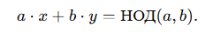
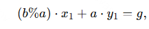
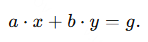
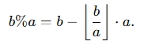
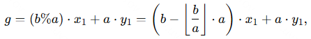
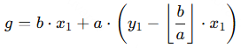
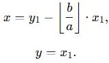

### Расширенный алгоритм Евклида

В отличие от "обычного" алгоритма Евклида, который просто находит наибольший общий делитель двух чисел \(a\) и \(b\), расширенный алгоритм Евклида находит, помимо НОД, также коэффициенты \(x\) и \(y\), такие, что:

Иными словами, он находит коэффициенты, с помощью которых НОД двух чисел выражается через сами эти числа.

---

### Алгоритм

Внести вычисление этих коэффициентов в алгоритм Евклида несложно, достаточно вывести формулы, по которым они меняются при переходе от пары \((a, b)\) к паре \((b\%a, a)\) (знаком процента обозначаем взятие остатка от деления).

Итак, пусть мы нашли решение \((x_1, y_1)\), заданное для новой пары \((b\%a, a)\):

и хотим получить решение \((x, y)\) для нашей пары \((a, b)\):

Для этого преобразуем величину \(b\%a\):

Подставим это в приведённое выше выражение с \(x_1\) и \(y_1\) и получим:

и, выполняя перегруппировку слагаемых, получаем:

Сравнивая это с исходным выражением над неизвестными \(x\) и \(y\), получаем требуемые выражения:

