# Вычисление биномиальных коэффициентов по модулю

Этот проект посвящён эффективному вычислению биномиальных коэффициентов \( C(N, K) \mod M \), где \( M \) — простое число. Здесь собрана вся необходимая теория, алгоритмы и пример реализации.

---

## Содержание

1. [Шаг 1: Предварительное вычисление факториалов и их обратных элементов](#шаг-1-предварительное-вычисление-факториалов-и-их-обратных-элементов)
2. [Шаг 2: Вычисление биномиальных коэффициентов для каждого запроса](#шаг-2-вычисление-биномиальных-коэффициентов-для-каждого-запроса)
3. [Почему работает рекуррентная формула для обратных факториалов](#почему-работает-рекуррентная-формула-для-обратных-факториалов)
   - [Определения и основные свойства](#определения-и-основные-свойства)
   - [Вычисление обратных факториалов](#вычисление-обратных-факториалов)
   - [Доказательство формулы](#доказательство-формулы)
   - [Интуитивное объяснение](#интуитивное-объяснение)
4. [Малая теорема Ферма](#малая-теорема-ферма)
   - [Нахождение обратного элемента](#нахождение-обратного-элемента)
   - [Вывод формулы для обратного элемента](#вывод-формулы-для-обратного-элемента)

---

## Шаг 1: Предварительное вычисление факториалов и их обратных элементов

Мы заранее вычисляем массивы факториалов и обратных факториалов, чтобы отвечать на каждый запрос за \( O(1) \) времени.

### Вычисление факториалов \( \text{fact}[] \)

Массив \( \text{fact}[] \) содержит факториалы по модулю \( M \):

1. **Инициализация**:
   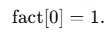
2. **Рекуррентное вычисление**:
   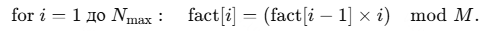

### Вычисление обратных факториалов \( \text{invFact}[] \)

Обратные факториалы используются для деления по модулю:

1. **Вычисляем \( \text{invFact}[N_{\text{max}}] \)**:
   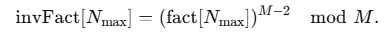
2. **Рекуррентное вычисление остальных значений**:
   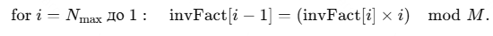

---

## Шаг 2: Вычисление биномиальных коэффициентов для каждого запроса

Для вычисления биномиального коэффициента \( C(N, K) \mod M \) используем формулу:

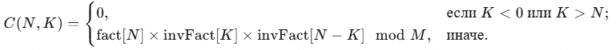

Алгоритм:

1. **Вычисляем коэффициент**:
   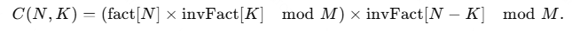

---

## Почему работает рекуррентная формула для обратных факториалов

Рекуррентная формула для обратных факториалов:

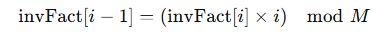

### Определения и основные свойства

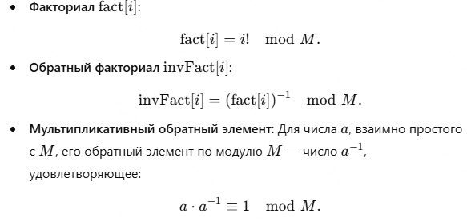

### Вычисление обратных факториалов

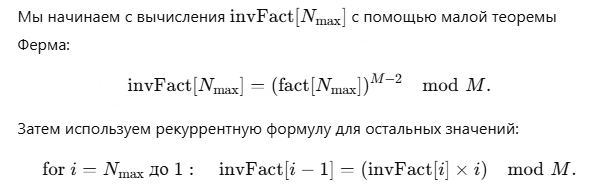

### Доказательство формулы

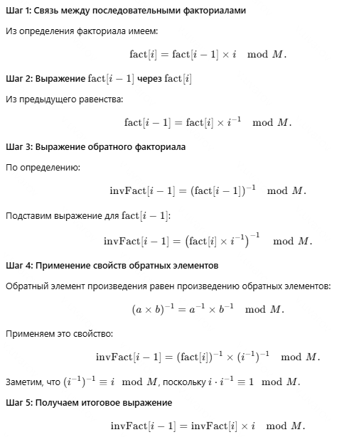

### Интуитивное объяснение

Мы "переносим" умножение на \( i \) из факториала в обратный элемент. Это упрощает вычисления и сохраняет корректность.

---

## Малая теорема Ферма

### Нахождение обратного элемента

Если \( p \) — простое число, и \( a \) взаимно просто с \( p \), то:

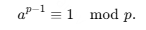

Обратный элемент находится как:

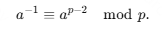

### Вывод формулы для обратного элемента

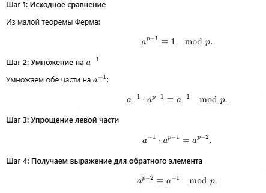

---

## Заключение

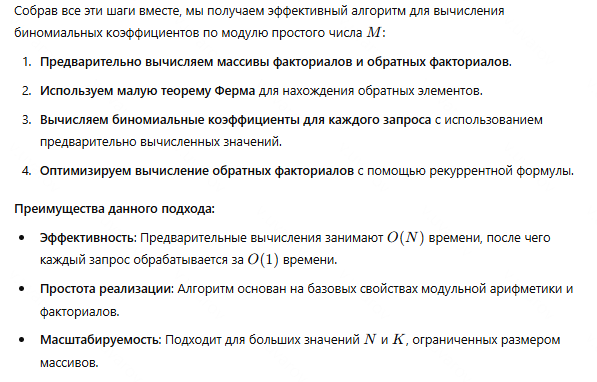
