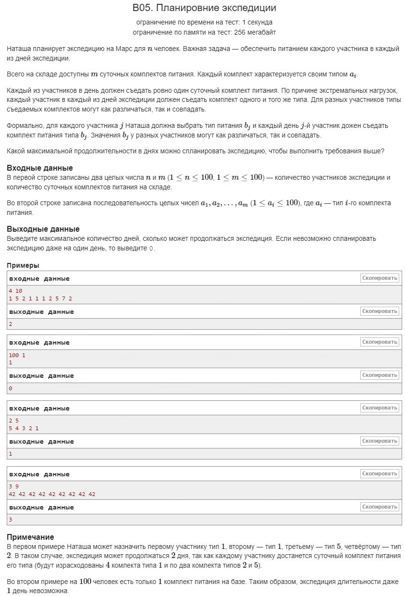

В данной задаче используется метод двоичного поиска для нахождения максимального количества дней \( D \), в течение которых можно распределить суточные комплекты питания среди участников экспедиции, соблюдая условия задачи.

### Описание решения

1. **Чтение входных данных и подсчёт комплектов**: 
   
   В начале считываются данные, и для каждого комплекта питания подсчитывается количество комплектов каждого типа в массиве `arr`. Массив `arr` хранит количество комплектов каждого типа питания (индексы — это типы питания, значения — количество комплектов).
```cpp
   vector<int> arr(101);
   for (int i = 0; i < m; ++i) {
       int num;
       cin >> num;
       ++arr[num];
   }
```
2. **Определение границ для двоичного поиска**:
   
   Инициализируются границы для двоичного поиска:
```cpp
   int l = 0, r = m / n + 1, ans = 0;
```
   - `l = 0`: минимальная возможная длина экспедиции.
   - `r = m / n + 1`: максимальная возможная длина экспедиции, так как это гарантирует, что даже при равном распределении питания для всех участников не будет упущена максимальная длина экспедиции.
   - `ans = 0`: переменная для хранения найденного максимального значения \( D \).

3. **Цикл двоичного поиска**:
   
   Цель — найти максимальное \( D \), при котором можно обеспечить питание всем участникам. Для этого используется двоичный поиск по диапазону от \( l \) до \( r \):
```cpp
   while (l <= r) {
       int c = (l + r) / 2;
       if (c == 0) {
           break;
       }
       if (cheak(c, arr)) {
           l = c + 1;
           ans = c;
       } else {
           r = c - 1;
       }
   }
```
   **Остановка цикла**: Цикл прекращает свою работу, когда левая граница \( l \) становится больше правой \( r \). Это означает, что весь возможный диапазон значений \( D \) был проверен, и двоичный поиск завершён.

4. **Функция проверки** (`cheak`):
   
   Функция `cheak` проверяет, можно ли распределить питание среди участников в течение \( k \) дней:
```cpp
   bool cheak(int k, vector<int> arr) {
       int sum = 0;
       for (int i = 1; i < 101; ++i) {
           sum += arr[i] / k;
       }
       return sum >= n;
   }
```
   Для каждого типа питания считается, сколько участников можно накормить в течение \( k \) дней, и затем проверяется, достаточно ли этого для всех \( n \) участников.

5. **Вывод результата**:
   
   После завершения двоичного поиска выводится максимальное количество дней, которое удалось найти:
```cpp
   cout << ans;
```
### В какой момент останавливается цикл `while (l <= r)`:

Цикл прекращает свою работу в двух случаях:

1. **Когда левая граница больше правой**: то есть, \( l > r \). Это условие означает, что все возможные значения \( D \) (количества дней) уже проверены, и максимальное возможное значение сохранено в переменной `ans`.
   
2. **Если \( c = 0 \)**: проверка предотвращает случай, когда проверка питания на \( 0 \) дней может быть выполнена, что бессмысленно. Как только \( c = 0 \), цикл принудительно прерывается с помощью `break`.

Основным условием завершения двоичного поиска является ситуация \( l > r \).