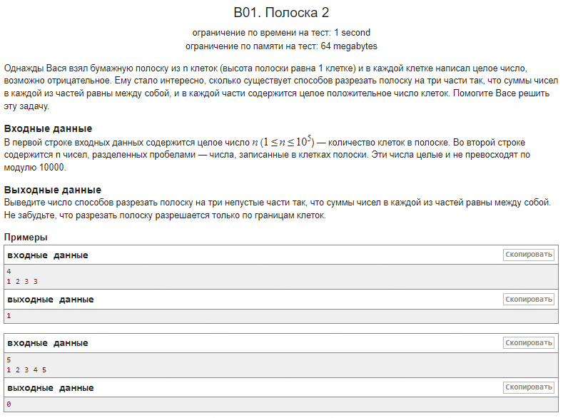

### Решение задачи "Полоска 2"

Данный алгоритм предназначен для поиска количества способов разрезать массив на три непустые части, такие что суммы чисел в каждой из этих частей равны.

#### Основная идея:
1. **Предварительная проверка:**
   - Алгоритм начинает с вычисления префиксных сумм, которые позволяют получить сумму элементов от начала массива до текущей позиции.
   - Если общая сумма массива `arr[n]` (префиксная сумма последнего элемента) не делится на три, то ответ сразу равен `0`, так как невозможно разделить массив на три части с равными суммами.

2. **Поиск потенциальных точек разреза:**
   - Задача сводится к поиску индексов, где сумма первых `i` элементов равна одной трети от общей суммы `arr[n]/3` и двух третей от общей суммы `2 * arr[n]/3`.
   - Перебираем все возможные разрезы (индексы от 1 до `n-1`) и проверяем значение префиксной суммы на каждой позиции.

3. **Логика подсчета:**
   - В процессе обхода массива используем две переменные:
     - `counter` — считает количество разрезов, на которых префиксная сумма равна `arr[n]/3`. Это означает, что найдено место, где первая треть массива может быть завершена.
     - `result` — отслеживает общее количество способов разрезать массив. Если на текущей позиции префиксная сумма равна `2 * arr[n]/3`, это означает, что можно завершить вторую треть массива. В таком случае к `result` добавляется текущее значение `counter`, так как каждая предыдущая точка, где сумма равна `arr[n]/3`, дает потенциальный способ разреза.

#### Пошаговое описание:
1. **Вычисление префиксных сумм:**
   - Создается массив `arr` для хранения префиксных сумм, где `arr[i]` — сумма элементов от начала до `i-й` позиции.
   - На каждой итерации к текущей сумме добавляется новое значение из исходного массива, чтобы построить префиксные суммы.

2. **Проверка делимости:**
   - Если `arr[n] % 3 != 0` (общая сумма не делится на 3), то выводится `0`, так как невозможно разрезать массив на три части с равными суммами.

3. **Подсчет разрезов:**
   - Инициализируются `counter` и `result` равными нулю.
   - Проход по всем позициям от 1 до `n-1`:
     - Если `arr[i]` равно `2 * arr[n] / 3`, это означает, что мы нашли точку, где заканчивается вторая треть массива, и добавляем значение `counter` к `result`.
     - Если `arr[i]` равно `arr[n] / 3`, увеличиваем `counter`, так как найдено место, где можно завершить первую треть массива.

4. **Вывод результата:**
   - После завершения перебора всех позиций значение `result` будет равно количеству способов разрезать массив на три части с равными суммами.

#### Пример работы алгоритма:
Для входных данных `[1, 2, 3, 3]`:
- Префиксные суммы: `[1, 3, 6, 9]`.
- Общая сумма `arr[n] = 9`. Делим ее на 3, получая `9 / 3 = 3` (одна треть) и `2 * 9 / 3 = 6` (две трети).
- На позиции 2 (`arr[2] = 3`), сумма равна одной трети `9 / 3`. Увеличиваем `counter` на 1.
- На позиции 3 (`arr[3] = 6`), сумма равна двум третям `2 * 9 / 3`. Добавляем значение `counter` к `result`, получаем `result = 1`.

Таким образом, существует один способ разрезать массив `[1, 2, 3, 3]` на три равные части.

#### Сложность алгоритма:
- Временная сложность: `O(n)`, так как требуется один проход для вычисления префиксных сумм и еще один для подсчета разрезов.
- Пространственная сложность: `O(n)`, так как используется массив префиксных сумм.
